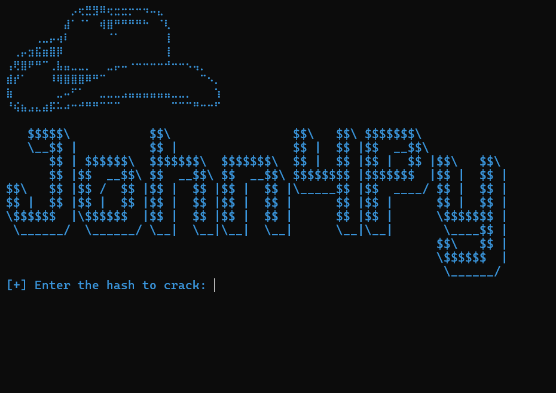

# 🛠️ John4py — Python-Powered Hash Cracker

**`John4py`** is a lightweight, multi-threaded hash cracking tool built in Python — inspired by **John the Ripper** but optimized for simplicity, speed, and clarity. Designed for ethical hacking, CTFs, and learning cryptographic concepts.

---

## ⚡ Features

- 🔎 **Auto-detects hash type** (`md5`, `sha1`, `sha256`)
- 🚀 **Multi-threaded** wordlist cracking using Python's `ThreadPoolExecutor`
- 🎨 **Colorized terminal output** for enhanced readability
- 🖼️ **ASCII banner display** (external file-based)
- 📄 **Custom wordlist support** (default: `rockyou.txt`)
- 🛑 Thread-safe stop when password is found

---

## 📸 Screenshot



---

## 🚀 Installation

```bash
# Clone the repository
git clone https://github.com/Muthukumaran-Official/john4py.git
cd john4py

# Install required Python packages
pip install -r requirements.txt
```

---

## 🧪 Usage

```bash
python john4py.py
```
---

## 🔐 Supported Hash Types

- MD5	✅
- SHA-1	✅
- SHA-256	✅
- bcrypt	🔜 (Planned)

## 🌟 Planned Features (Future)

- 🔐 Bcrypt and other advanced hash support
- 📊 Progress bar using tqdm
- 🧰 CLI flags for automation (argparse)
- 🖥️ GUI version using Tkinter or PyQt
- 📝 Export results to JSON or HTML
- 📁 Save cracked results to a file


## ❗ Disclaimer

- This tool is meant for **educational and ethical use only.**
- Do **NOT** use this on systems or data you do not own or have permission to test.
- The author is **not responsible** for any misuse.

## 📢 Contribution

Pull requests are welcome! Feel free to fork the repo, improve the tool, and submit a PR.  
Bug reports and feature suggestions are appreciated in [Issues](https://github.com/Muthukumaran-Official/John4py/issues).

---

## 📜 License

This project is licensed under the **MIT License**.  
See the LICENSE file for details.

---

## 🤖 Developed By
 
GitHub: [@Muthukumaran-Official](https://github.com/Muthukumaran-Official)  
LinkedIn: [@Muthukumaran](https://linkedin.com/muthukumaran-poovelan/)
